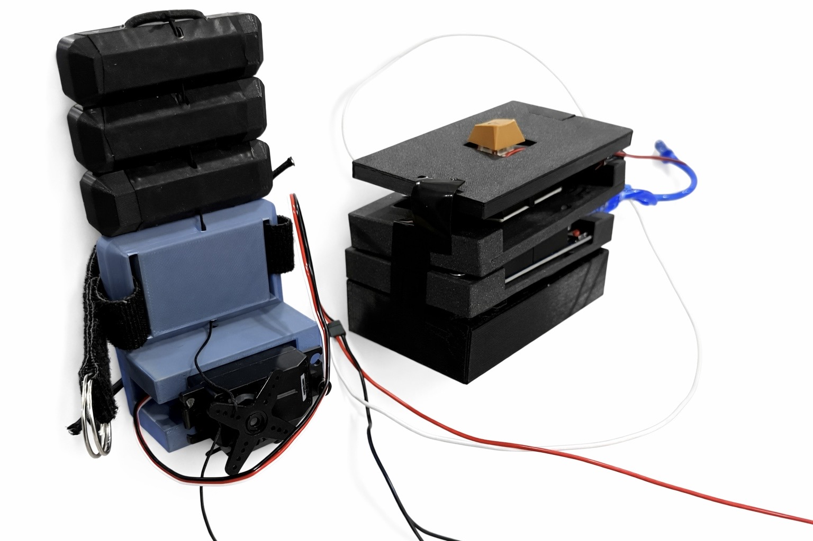
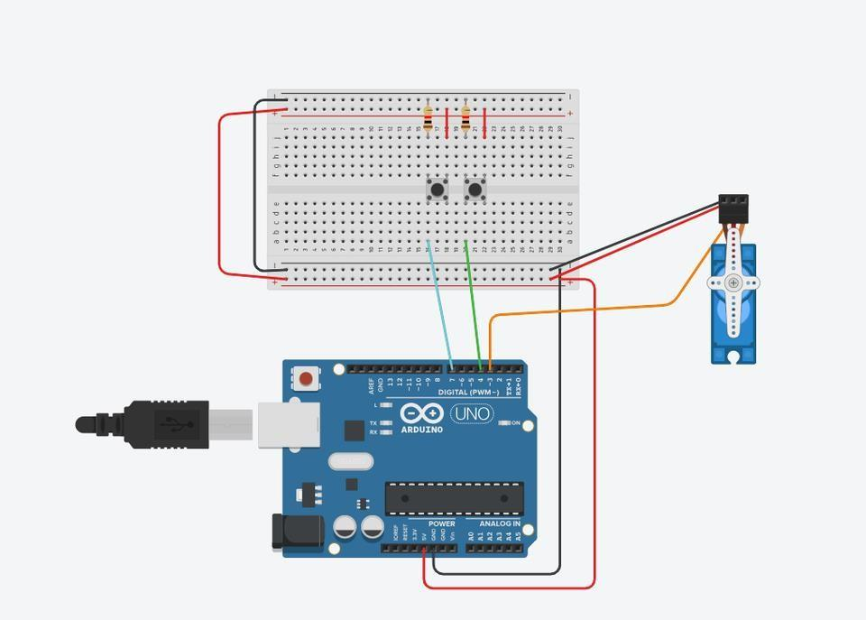
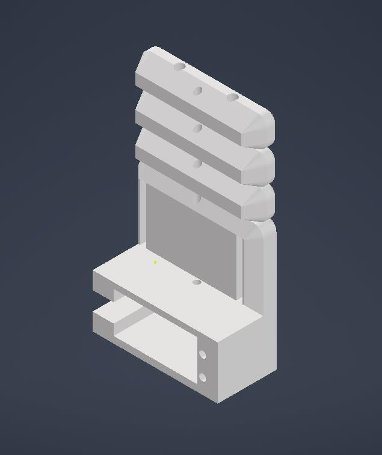

# Assistive Robotic Gripper

A wearable, button-controlled gripper designed to help users with limited hand dexterity handle small everyday objects with less finger movement.

## Project overview

This team engineering project combined mechanical design, embedded control, rapid prototyping, and iterative testing. The final prototype uses a 3D-printed articulated gripper driven by a continuous-rotation servo. A single push button controls gripping, stopping, and return motion, while an adjustable hand strap and high-friction contact surfaces improve usability.

## Key results

| Metric | Result |
| --- | ---: |
| Prototype mass | 150.2 g |
| Mass reduction during iteration | 42.5% |
| Mean closing time | 4.19 s |
| Successful tested object diameter | 15.7–36.5 mm |
| Highest tested held mass | 50.0 g |
| Final comfort ratings | 7.5–9.0 / 10 |
| 3D-printing time | 6 h 49 min |

## Engineering highlights

- Designed and evaluated concepts using weighted criteria including usability, compactness, practicality, and required hand movement.
- Developed a three-state Arduino controller for forward motion, intermediate stopping, and timed return.
- Reduced total mass from 261.2 g to 150.2 g by optimizing the electronics layout.
- Improved comfort using an adjustable strap and increased grip using high-friction contact material.
- Evaluated timing, object compatibility, mass, dimensions, comfort, and drop durability.
- Used test results to identify limitations with very thin objects and guide geometry improvements.

## My contributions

- Developed and refined the Arduino control logic.
- Defined prototype objectives, constraints, and testing metrics.
- Contributed to durability, dimensional, and functional testing.
- Researched material options for lightweight rapid prototyping.
- Analyzed test results and helped guide design iterations.

## System architecture

The Arduino reads an active-low push button and sends calibrated pulse widths to a continuous-rotation servo. The first press closes the gripper, the second can stop it early, and the third reverses it for the recorded forward duration.

| Connection | Assignment |
| --- | --- |
| Push button | Arduino digital pin 7 |
| Servo signal | Arduino digital pin 3 |
| Servo supply | External 6 V battery pack |
| Ground | Common Arduino, servo, and battery ground |

The Arduino firmware is available in [`firmware/controller.ino`](firmware/controller.ino).

## Mechanical design

The structure was modelled for additive manufacturing in PLA. The articulated contact blocks close around objects while the hand-mounted base supports the servo and adjustable strap.

## Tools and skills

- Arduino and C++
- Servo control and embedded state logic
- Autodesk Inventor CAD
- Additive manufacturing and PLA prototyping
- Circuit prototyping
- Engineering testing and data analysis
- Human-centred iterative design

## Project context

Developed as a team project in McMaster University's Integrated Cornerstone Design Projects in Engineering course. This prototype was created for educational design evaluation and is not a certified medical device.
